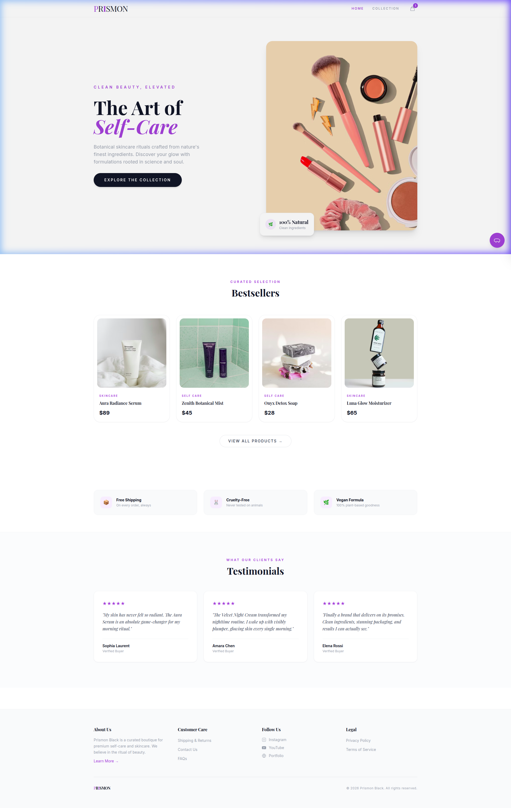
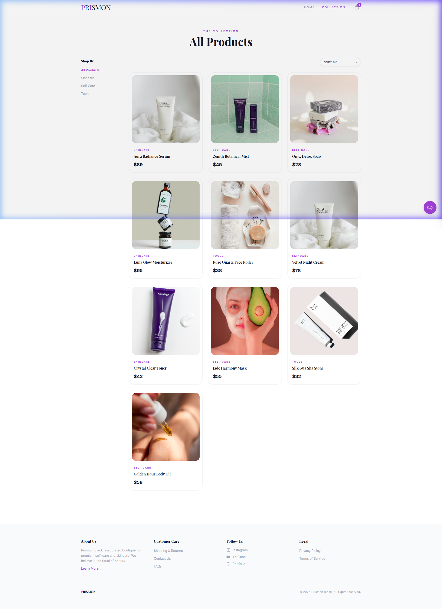

<p align="center">
  
</p>

<h1 align="center">
  ✦ PRISMON BOUTIQUE ✦
</h1>

<p align="center">
  <em>A premium, editorial-style e-commerce storefront built entirely with vanilla technologies.</em>
</p>

<p align="center">
  
  
  
  
</p>

<p align="center">
  <a href="https://www.instagram.com/erro_rcodee" target="_blank"></a>
  <a href="https://www.youtube.com/@Bingxxo" target="_blank"></a>
  <a href="https://portfolio-rishav.pages.dev/" target="_blank"></a>
</p>

---

## ✨ Overview

**Prismon Boutique** is a fully functional, zero-backend e-commerce single-page application designed with a high-end editorial aesthetic. Think *Apple meets Vogue* — bright whites, rich serif typography, subtle lavender accents, and buttery-smooth interactions.

Everything runs client-side: product browsing, cart management, multi-step checkout, and even a live chatbot — all powered by vanilla JavaScript and `localStorage`.

<p align="center">
  
</p>

---

## 🏗️ Architecture

```
eshop/
├── index.html          → SPA shell (hash-based routing)
├── about.html          → Brand story & values
├── contact.html        → Contact form & info
├── shipping.html       → Shipping & returns policy
├── faqs.html           → Interactive FAQ accordions
├── privacy.html        → Privacy policy
├── terms.html          → Terms of service
├── css/
│   └── styles.css      → Custom animations & styles
├── js/
│   └── main.js         → Full application engine
└── assets/
    └── preview-*.png   → README screenshots
```

---

## 🎨 Design System

| Element | Choice |
|---|---|
| **Background** | Pure white `#FFFFFF` |
| **Text** | Rich charcoal `#1F2937` |
| **Accent** | Sophisticated lavender `#9370DB` |
| **Headings** | Playfair Display (Serif) |
| **Body** | Inter (Sans-Serif) |
| **Buttons** | Pill-shaped, rounded-full |
| **Cards** | `rounded-3xl`, subtle borders, hover lift |

---

## ⚡ Features

### 🛍️ Core Shopping
- **Dynamic SPA Routing** — Hash-based navigation (`#home`, `#catalog`, `#category/:name`, `#checkout`)
- **Product Catalog** — 10 premium skincare items with filtering by category and sorting by price
- **Quick View Modal** — Full product details with stock indicators and add-to-cart
- **Persistent Cart** — `localStorage`-backed cart that survives page refreshes and cross-page navigation
- **Multi-Step Checkout** — Shipping → Payment → Review → Order Confirmation with animated progress

### 💬 Live Chatbot
- Context-aware responses for shipping, returns, ingredients, payments, and tracking
- Typing indicator animation and smooth message transitions
- Auto-hides when cart drawer opens to prevent UI overlap

### 🧩 Multi-Page Architecture  
- 7 HTML pages sharing identical `<nav>`, `<footer>`, cart drawer, and chatbot
- External CSS/JS ensure consistent functionality everywhere
- Footer links wired to real pages, social links open in new tabs

### 🎯 UI Polish
- Premium editorial logo with accent-styled letters
- Value proposition bar (Free Shipping, Cruelty-Free, Vegan Formula)
- Customer testimonials section with verified buyer badges
- Toast notification system with success/error/warning states
- Responsive design — mobile-first, striking on desktop

---

## 🚀 Quick Start

```bash
# Clone the repository
git clone https://github.com/rishwebb/store-v2.0.git
cd store-v2.0

# Serve locally (any static server works)
npx -y serve . -l 3000

# Open in browser
open http://localhost:3000
```

> No build step. No `npm install`. No framework. Just open and go.

---

## 🛠️ Tech Stack

| Layer | Technology |
|---|---|
| **Structure** | HTML5 semantic markup |
| **Styling** | Tailwind CSS (CDN) + custom CSS |
| **Logic** | Vanilla JavaScript (ES6+) |
| **State** | `localStorage` for cart persistence |
| **Routing** | `window.location.hash` based SPA |
| **Fonts** | Google Fonts (Playfair Display + Inter) |
| **Icons** | Inline SVG |

---

## 📄 Pages

| Page | Description |
|---|---|
| `index.html` | SPA — Home, Catalog, Categories, Checkout |
| `about.html` | Brand story with botanicals image & 3 value pillars |
| `contact.html` | Contact form with name, email, subject, message |
| `shipping.html` | Shipping & returns policy with info cards |
| `faqs.html` | 7 interactive FAQ accordions |
| `privacy.html` | 6-section privacy policy |
| `terms.html` | 8-section terms of service |

---

## 📜 License

This project is open source and available under the [MIT License](LICENSE).

---

<p align="center">
  <strong>Built with 💜 by <a href="https://portfolio-rishav.pages.dev/">Rishav</a></strong>
</p>
